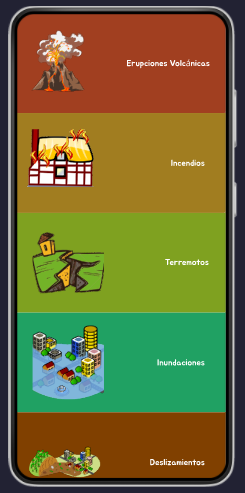
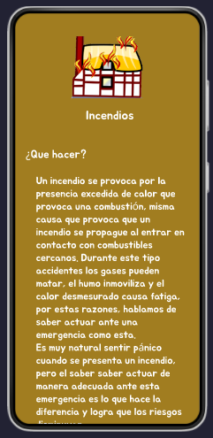

# Diseño de interfaz de usuario

La interfaz de usuario de la aplicación  esta diseñada para que sea de fácil acceso para 
los usuarios, y se pueda ver correctamente que tipo desastre quiere consultar.

El diseño esta disponible 
en [Figms](https://www.figma.com/proto/C1WVOjjnK6y0pXUu1TuiOB/Untitled?type=design&node-id=5-2&t=G9Tv3XZe3uYRzbzt-0&scaling=scale-down&page-id=0%3A1)

1. Pantalla de inicio de la aplicación
    En la pantalla de inicio el usuario podrá elegir una de las 5 opciones que le dará acceso la la información de que eligió 

    

2. Pantalla de información
    En la pantalla de información se muestra lo que tiene que hacer durante un desastre en el caso del ejemplo es informacion de que hacer en caso de incendios

    